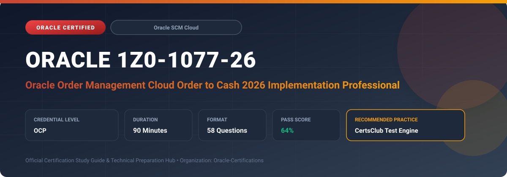

  

# Oracle 1Z0-1077-26: Oracle Order Management Cloud Order to Cash 2026 Implementation Professional

---

## 1. Exam Overview & Candidate Profile

The **Oracle 1Z0-1077-26: Oracle Order Management Cloud Order to Cash 2026 Implementation Professional** examination is engineered for enterprise architects, solution specialists, functional consultants, and implementation professionals seeking formal industry recognition of their proficiency in Oracle technologies.

The Oracle Order Management Cloud Order to Cash 2026 Implementation Professional (1Z0-1077-26) certification confirms mastery in implementing comprehensive order orchestration, automated pricing, global promising, and cross-pillar fulfillment integrations. Candidates validate skills in handling complex order revisions, exception handling, and multi-channel intake.

### Target Audience & Prerequisites
- **Target Roles**: Implementation Specialists, Cloud Architects, Technical Leads, Enterprise Functional Consultants, and Systems Engineers.
- **Recommended Experience**: 1–2 years of practical, hands-on experience designing, implementing, and maintaining corresponding Oracle Cloud solutions.
- **Credential Earned**: Oracle Certified Professional (OCP).

---

## 2. Key Exam Specifications

| Specification | Details |
| :--- | :--- |
| **Exam Code** | **Oracle 1Z0-1077-26** |
| **Official Title** | Oracle Order Management Cloud Order to Cash 2026 Implementation Professional |
| **Certification Track** | Oracle Supply Chain Management Cloud |
| **Exam Duration** | 90 Minutes |
| **Number of Questions** | 58 Questions |
| **Passing Score** | 64% |
| **Question Format** | Multiple Choice (Single/Multiple Answer), Scenario-Based Questions |
| **Delivery Provider** | Oracle University / Pearson VUE (Online Proctored or Test Center) |
| **Recommended Practice Engine** | [CertsClub Oracle Practice Tests](https://www.certsclub.com/oracle/1z0-1077-26-dumps.html) |

---

## 3. Official Blueprint & Exam Domain Breakdown

The examination assesses candidate competencies across core functional domains weighted as follows:

| Domain Area | Weighting |
| :--- | :--- |
| **Order Management Cloud Parameter Setup & Processing** | `25%` |
| **Distributed Order Orchestration (DOO) & Fulfillment** | `25%` |
| **Pricing Strategies, Price Lists & Discount Algorithms** | `20%` |
| **Global Order Promising (GOP) & Sourcing Rules** | `15%` |
| **Shipping Execution & Financials/Billing Integration** | `15%` |

---

## 4. Deep Dive into Complex & Challenging Technical Topics

To secure a passing score on the 1Z0-1077-26 exam, candidates must master the following advanced concepts:

- Designing robust DOO process flows with pause tasks, routing rules, and change order management compensation logic.
- Extending pricing algorithms with groovy script logic, custom service mappings, and tiered volume discounts.
- Configuring Global Order Promising with transit times, supplier capacity calendars, and supply allocation buckets.
- Integrating Order Management with Oracle Receivables for invoice generation, revenue recognition, and debit/credit memo adjustments.

---

## 5. Scenario-Based Demo & Practice Questions

### Question 1
During sales order scheduling, Global Order Promising (GOP) determines that the requested inventory organization has zero stock, but a central warehouse can fulfill the request within 48 hours. Which GOP mechanism executes this determination?

A) Sourcing Rules and ATP Rules
B) Movement Request Dispatcher
C) Landed Cost Trade Operation
D) Receivables Billing Profile

- **Correct Answer**: `A) Sourcing Rules and ATP Rules`  
- **Technical Explanation**: GOP uses Sourcing Rules (defining where products can be procured, manufactured, or transferred from) combined with Available-To-Promise (ATP) rules and shipping network transit lead times to schedule valid fulfillment dates.

---

### Question 2
In Oracle Order Management Cloud, when a customer submits a revision to an order that has already released picking tasks in the warehouse, how does the system prevent fulfillment conflicts?

A) It immediately deletes the shipping line without notice.
B) It triggers compensation logic in the DOO orchestration process and sends a cancellation/hold request to warehouse shipping.
C) It rejects the order revision permanently.
D) It creates a duplicate sales order with negative quantities.

- **Correct Answer**: `B) It triggers compensation logic in the DOO orchestration process and sends a cancellation/hold request to warehouse shipping.`  
- **Technical Explanation**: Distributed Order Orchestration (DOO) includes automated compensation logic that evaluates whether downstream tasks (such as shipping) can be cancelled or recalled, placing a hold on the order line until the warehouse confirms status.

---

## 6. Recommended Preparation Strategy & Practice Testing Engine

Achieving certification in **Oracle 1Z0-1077-26** requires balanced theoretical study and scenario-based simulation practice:

1. **Review Oracle Documentation**: Master architecture guides, implementation workbooks, and administration manuals on the Oracle Help Center.
2. **Hands-on Lab Practice**: Execute real-world configuration, policy setup, and troubleshooting tasks in your cloud tenancy or test instance.
3. **Simulated Exam Drills**: Practice answering timed, scenario-based multiple-choice questions to familiarize yourself with the question formats, traps, and timing constraints.

### Practice With CertsClub
For realistic practice questions, updated dumps, and mock testing environments:
- **Resource**: [CertsClub Oracle Practice Test Engine](https://www.certsclub.com/oracle/1z0-1077-26-dumps.html)
- **Special Discount**: Use coupon code **`club20`** during checkout for an instant **20% discount** on all practice exam bundles and testing engines.

---

## 7. Official Documentation & References

- [Oracle University Certification Registry](https://education.oracle.com/)
- [Oracle Help Center Documentation Portal](https://docs.oracle.com/)
- [Oracle Cloud Infrastructure & Applications Guides](https://docs.oracle.com/en/cloud/)
- [CertsClub Oracle Certification Exam Practice](https://www.certsclub.com/oracle/1z0-1077-26-dumps.html)

---

## 8. SEO & Discovery Keywords

`oracle 1z0-1077-26, oracle 1z0-1077-26 exam, oracle 1z0-1077-26 dumps, 1Z0-1077-26 practice questions, 1Z0-1077-26 study guide, oracle 1z0-1077-26 syllabus, oracle order management cloud order to cash 2026 implementation professional, certsclub 1z0-1077-26`
